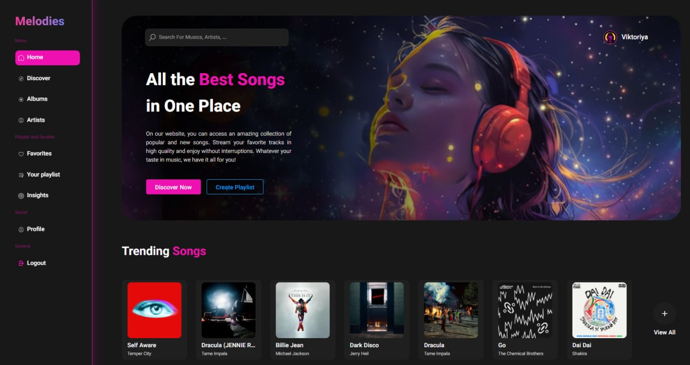

# 🎵 Music Search and Listening App

Повноцінний вебзастосунок для пошуку, перегляду та прослуховування музики.

## 🌐 Демо

🔗 https://music-henna-gamma.vercel.app/

---
## 📸 Вигляд застосунку



## Макет Figma
https://www.figma.com/design/xLl9h7UWwr65pN8gB7HUTL/Music-Player-Website---App--Melodies---Community-

# ✨ Можливості
- Реєстрація/Вхід
- 🔎 Пошук треків та виконавців
- 🎧 Прослуховування музичних прев'ю
- ❤️ Додавання треків до обраного
- Створення плейлистів, спільний плейлист
- 👤 Сторінки виконавців
- 💿 Перегляд альбомів
- 🎲 Випадковий вибір альбому
- 📊 Статистика прослуховувань
- Система друзів
- Сумісність муз. смаку у відсотках з другом

---

# 🛠 Використані технології

## Frontend

- React 
- TypeScript
- Vite
- Tailwind CSS
- React Router
- Zustand
- React Query
- React H5 Audio Player

## Backend

- Node.js
- Express
- TypeScript
- Axios
- Node Cache
- CORS

## Бази даних та сервіси

- Supabase
- Deezer API

## Розгортання

- Vercel (Frontend)
- Railway (Backend)

---

# 📂 Структура проєкту

Проєкт складається з двох основних частин: frontend та backend.

│
├── front                         # Клієнтська частина (React + TypeScript)
│   │
│   ├── public                    # Статичні файли
│   │
│   ├── src
│   │   ├── components            # UI компоненти
│   │   ├── context               # Глобальний стан 
│   │   ├── pages                 # Сторінки 
│   │   ├── hooks                 # Кастомні React hooks
│   │   ├── layout                # Компоненти макета сторінок
│   │   ├── service               # Логіка роботи із зовнішніми сервісами та API
│   │   └── types                 # TypeScript типи
│   │
│   ├── package.json
│   └── vite.config.ts
│
├── backend                       # Серверна частина (Express + TypeScript)
│   │
│   ├── src
│   │   └── server.ts             # Точка запуску сервера запити до Dezeer Api
│   │
│   ├── package.json
│   └── tsconfig.json
│
└── README.md
```

---

# 🚀 Встановлення та запуск

## Клонування репозиторію

```bash
git clone https://github.com/Vviktoriyya/MusicSearchAndListeningAppDiploma.git

cd MusicSearchAndListeningAppDiploma
```

---

# Налаштування Frontend

Перейти у папку frontend:

```bash
cd front
```

Встановити залежності:

```bash
npm install
```

Запуск у режимі розробки:

```bash
npm run dev
```

Frontend буде доступний за адресою:

```
http://localhost:5173
```

---

# Налаштування Backend

Перейти у папку backend:

```bash
cd backend
```

Встановити залежності:

```bash
npm install
```

Запуск сервера:

```bash
npm run dev
```

Backend буде доступний за адресою:

```
http://localhost:5000
```

---

# 🔐 Змінні середовища

## Frontend `.env`

Створити файл:

```
front/.env
```

Додати:

```env
VITE_SUPABASE_URL=ваш_supabase_url
VITE_SUPABASE_KEY=ваш_supabase_key
VITE_API_URL=адреса_backend
```


## Backend `.env`

Створити файл:

```
backend/.env
```

Додати:

```env
PORT=5000
```

---

# 🔌 API маршрути

## Трендові треки

```
GET /api/trending
```

## Пошук

```
GET /api/search/all?q=запит
```

## Виконавці

```
GET /api/top-artists
```

```
GET /api/artist/:id
```

```
GET /api/artist/:id/albums
```

## Альбоми

```
GET /api/album/random
```

```
GET /api/album/:id
```

## Плейлисти

```
GET /api/playlists/:id
```

---


# 🚀 Розгортання

## Frontend

Розгорнуто на Vercel:

🔗 https://music-henna-gamma.vercel.app/

Оновлення відбувається автоматично після push у гілку `main`.

Приклад:

```bash
git add .
git commit -m "Оновлення frontend"
git push origin main
```

---

## Backend

Розгорнуто на Railway:

🔗 https://music-production-c378.up.railway.app/

---


# 🧪 Скрипти

## Frontend

Запуск:

```bash
npm run dev
```

Збірка:

```bash
npm run build
```

Перегляд збірки:

```bash
npm run preview
```

---

## Backend

Запуск розробки:

```bash
npm run dev
```

Запуск production:

```bash
npm start
```

---

# 👩‍💻 Автор

**Vviktoriyya**

GitHub:

https://github.com/Vviktoriyya

---
